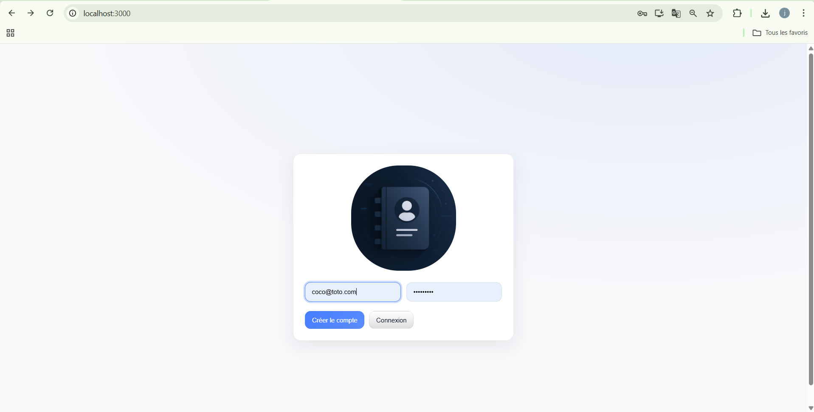
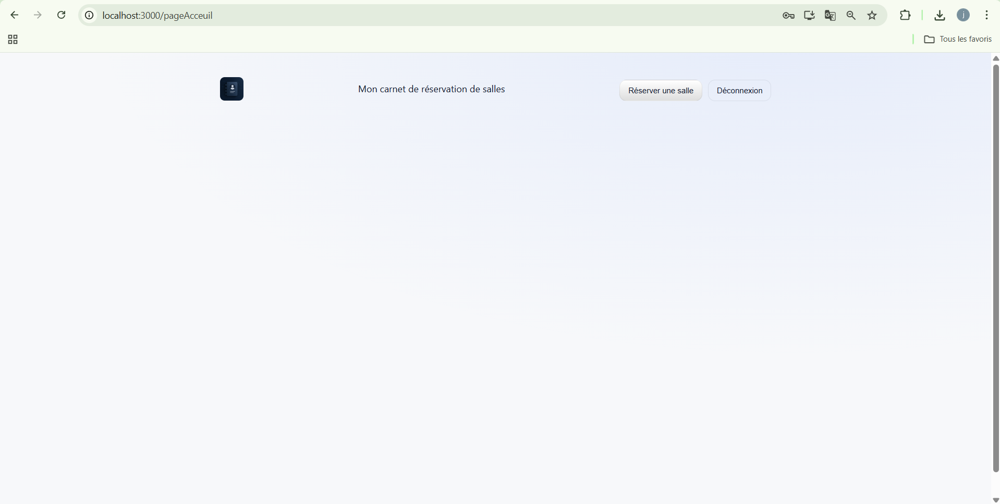
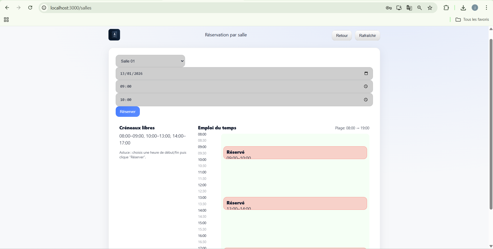

# 📅 Application de réservation de salles

Application **fullstack MERN** EASYBOOKING permettant l’authentification des utilisateurs et la réservation de salles avec visualisation des disponibilités sous forme d’emploi du temps.

---

## 🚀 Fonctionnalités

- 🔐 Authentification (inscription / connexion)
- 👤 Gestion des sessions via JWT
- 🏢 Liste des salles disponibles
- 📆 Réservation par date et créneau horaire
- ⏱️ Visualisation des créneaux libres et réservés
- 🧭 Interface moderne et responsive

---

## 🖼️ Captures d’écran

> Ajoutez vos captures d’écran dans le dossier `screenshots/` puis référencez-les ici :







---

## 🛠️ Stack technique

### Frontend
- React
- React Router
- Fetch API
- CSS moderne

### Backend
- Node.js
- Express
- MongoDB + Mongoose
- JWT
- CORS

---

## 🧪 Tests unitaires – Authentification des utilisateurs

Les tests unitaires ont été réalisés avec **Jest** et **Supertest** afin de valider le bon fonctionnement du modèle utilisateur et des routes d’authentification (`register` / `login`).

Chaque test vérifie un comportement précis (validation, sécurité, erreurs) et peut être accompagné d’une **capture d’écran de l’exécution**.

### 📋 Tableau des tests unitaires

| ID         | Composant testé | Description du test              | Données d’entrée              | Résultat attendu     | 
| ---------- | --------------- | -------------------------------- | ----------------------------- | -------------------- |
| TU-AUTH-01 | Modèle User     | Création d’un utilisateur valide | username valide, passwordHash | Utilisateur créé     |
| TU-AUTH-02 | Modèle User     | Création sans username           | username absent               | Erreur de validation |
| TU-AUTH-03 | Modèle User     | Création sans mot de passe       | passwordHash absent           | Erreur de validation |
| TU-AUTH-06 | Modèle User     | Username unique                  | même username deux fois       | Erreur duplicate key | 
| TU-AUTH-08 | Login           | Authentification valide          | username + password corrects  | Code 200 + token JWT | 
| TU-AUTH-09 | Login           | Username incorrect               | mauvais username              | Code 401             |
| TU-AUTH-10 | Login           | Mot de passe incorrect           | mauvais password              | Code 401             |
| TU-AUTH-11 | Login           | Login sans username              | username absent               | Code 400             |
| TU-AUTH-12 | Login           | Login sans mot de passe          | password absent               | Code 400             |
| TU-AUTH-13 | Sécurité        | Vérification du hash bcrypt      | password correct              | Comparaison true     |
| TU-AUTH-14 | JWT             | Génération du token              | login valide                  | Token non vide       |
| TU-AUTH-15 | JWT             | Contenu du token                 | token décodé                  | Contient userId      |
| TU-AUTH-16 | JWT             | Token invalide                   | token modifié                 | Accès refusé (401)   |
| TU-AUTH-17 | JWT             | Token manquant                   | aucun token                   | Accès refusé (401)   |
| TU-AUTH-18 | Middleware Auth | Accès avec token valide          | token valide                  | Accès autorisé       |
| TU-AUTH-19 | Middleware Auth | Accès avec token expiré          | token expiré                  | Accès refusé (401)   |
| TU-AUTH-20 | Middleware Auth | Accès avec token invalide        | token mal formé               | Accès refusé (401)   |
| TU-AUTH-21 | Route Users     | Récupération liste utilisateurs  | requête GET                   | Liste retournée      |
| TU-AUTH-22 | Route Users     | Utilisateur inexistant           | id inconnu                    | Code 404             |
| TU-AUTH-23 | Route Users     | Création utilisateur invalide    | données manquantes            | Code 400             |

---

### ▶️ Lancer les tests

```bash
npm test
```

Résultat attendu :

* 100 % des tests réussis
* Aucune erreur détectée
* Authentification sécurisée et fonctionnelle

---

## ⚙️ Installation

### 1️⃣ Cloner le projet
```bash
git clone https://github.com/johnwaia/ProjetTestLogiciel.git
cd ProjetTestLogiciel
```

### 2️⃣ Backend
```bash
cd backend
npm install
```

Créer un fichier `.env` :
```env
MONGO_URI=ton_uri_mongodb
PORT=5000
JWT_SECRET=ton_secret
```

Lancer le serveur :
```bash
npm start
```

### 3️⃣ Frontend
```bash
cd frontend
npm install
npm start
```

---

## ✅ Améliorations possibles

- Rôles (admin / utilisateur)
- Annulation de réservation
- Notifications
- Filtrage par salle
- Responsive mobile avancé

---

## 👨‍💻 Auteur

John WAIA

Projet réalisé dans un objectif **pédagogique et professionnel**.

---

## 📄 Licence

Libre d’utilisation pour un usage personnel ou éducatif.
